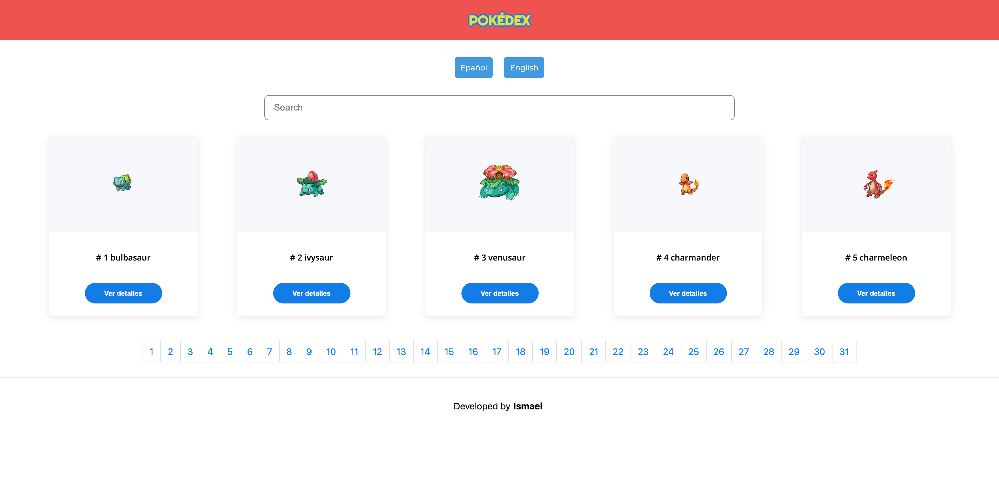

# Pokedex 🚀

Description: Aplication web called "Yoda" in honor Yoda Jedi, to get the coordinates of imperial ship and decrypt the secret message

## Available Scripts

In the project directory, you can run this commands:

## Fist step, install the packages with `npm install` ⚙️

Run the project in local, you need to run the server to get data:

### `npm run dev` ✅

# Technologies 🛠

Node, Express, JavaScript, React, Next

insert payload

[See the app](https://pokedex-beige-sigma.vercel.app/) 📦
